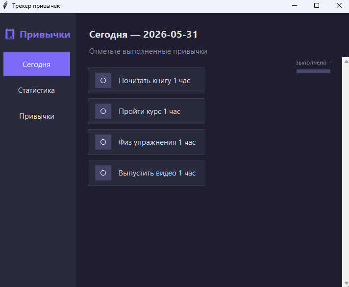

# 📊 Трекер привычек (Habit Tracker)

Простое и удобное десктопное приложение на Python для отслеживания ежедневных привычек. Помогает визуализировать прогресс и не терять мотивацию!

---

## 🎨 Интерфейс приложения


---

## ✨ Особенности (Features)
* 🔐 **Локальное хранение:** Все данные автоматически сохраняются в файл.
* 🎨 **Красивый UI:** Стильный темный интерфейс, построенный на стандартной библиотеке `Tkinter`.
* 📅 **Удобный учет:** Легко добавлять новые привычки и отмечать выполнение.

---

## 🛠 Технологический стек
* **Язык:** Python 3.x
* **Интерфейс:** Tkinter (GUI)

---

## 🚀 Как запустить проект локально

### 1. Клонируйте репозиторий:
```bash
git clone [https://github.com/iamnotperfect13/habit-tracker.git](https://github.com/iamnotperfect13/habit-tracker.git)
cd habit-tracker
